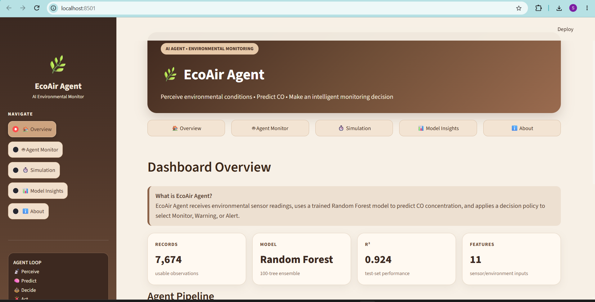
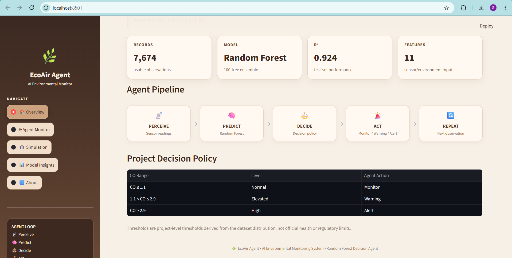
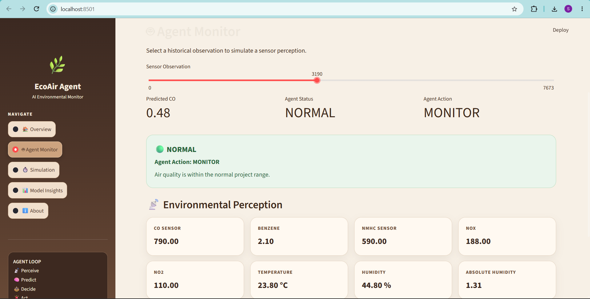
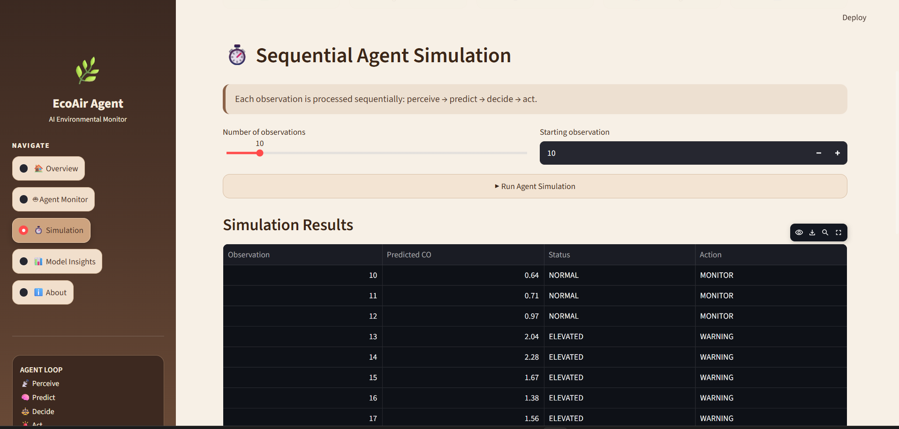
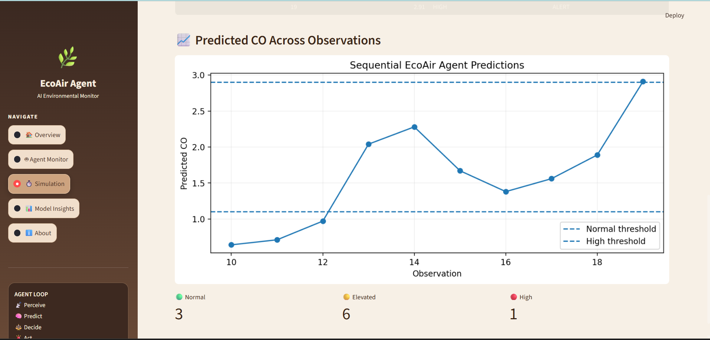
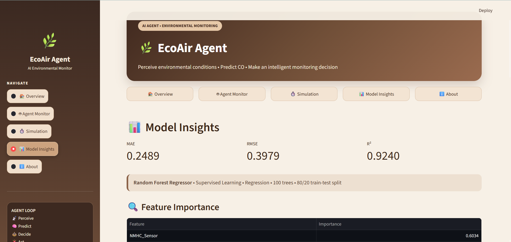
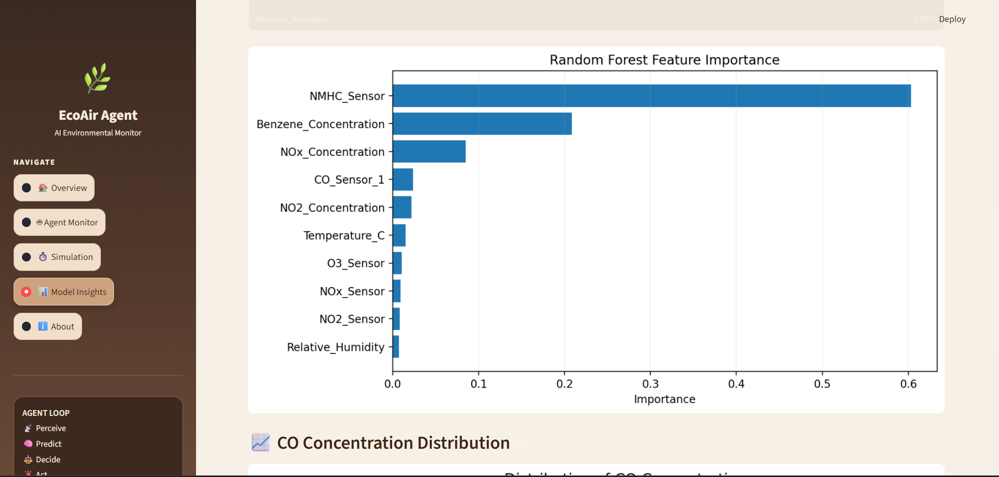
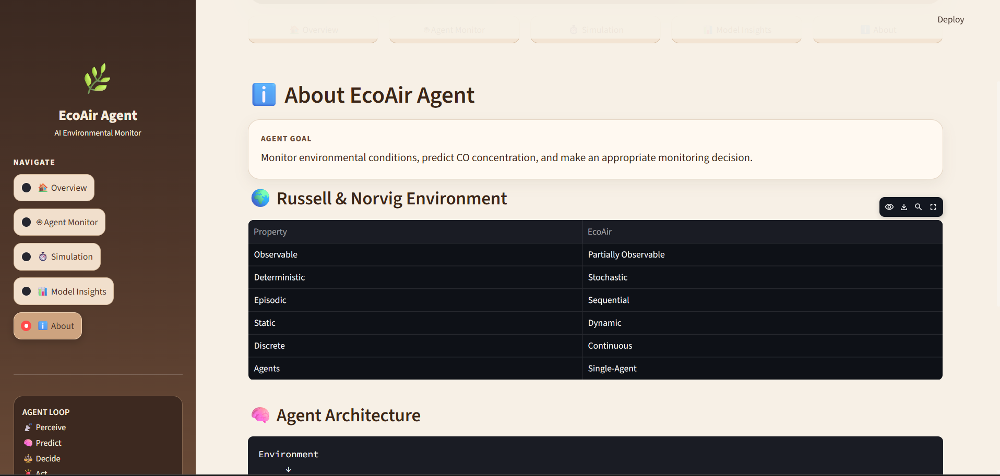
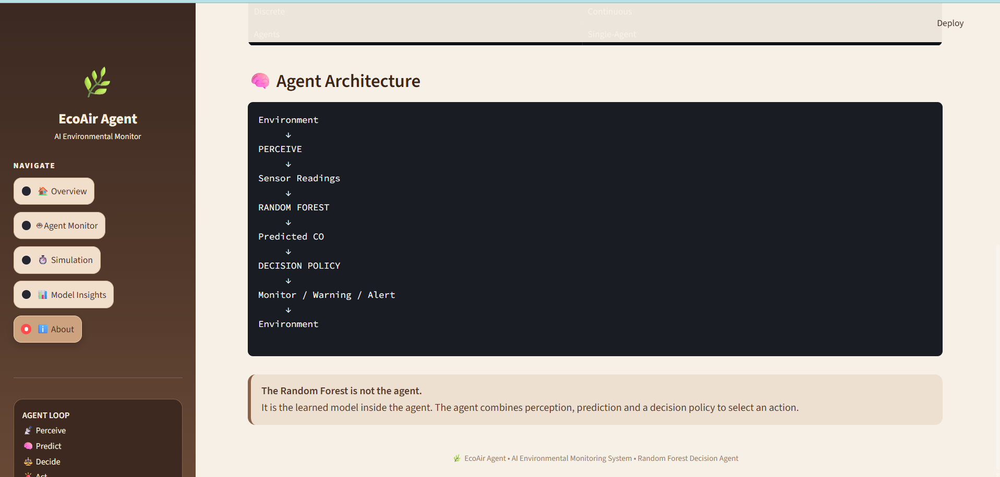

# 🌿 EcoAir Agent

## AI-Based Environmental Monitoring & Decision System

**EcoAir Agent** is an AI-based environmental monitoring agent that receives environmental sensor readings, uses a trained **Random Forest Regressor** to predict CO concentration, and applies a decision policy to select an appropriate monitoring action.

The system is designed as an **AI agent**, not just a standalone machine-learning model:

```text
Environment
     ↓
PERCEIVE
     ↓
Sensor Readings
     ↓
RANDOM FOREST
     ↓
Predicted CO
     ↓
DECISION POLICY
     ↓
Monitor / Warning / Alert
     ↓
Environment
```

> **Key concept:** The Random Forest is **not the agent**. It is the learned model inside the agent. The complete agent combines perception, prediction, decision-making, and action.

---

## ✨ Features

- 🌍 Russell & Norvig environment classification
- 📊 UCI Air Quality Dataset
- 🧹 Data cleaning and preprocessing
- 🧠 Supervised Random Forest regression
- 📈 Model evaluation with MAE, RMSE and R²
- 🔍 Feature-importance analysis
- 🤖 Agent Monitor with simulated sensor perception
- ⏱️ Sequential agent simulation
- 🚦 Monitor / Warning / Alert decision policy
- 📊 Interactive model-insights dashboard
- ☕ Coffee/beige Streamlit interface
- 🔄 Perceive → Predict → Decide → Act workflow

---

# 🎯 Project Goal

EcoAir Agent is designed to:

1. **Perceive** environmental sensor readings.
2. **Predict** CO concentration using a learned Random Forest model.
3. **Interpret** the predicted CO value using a project-level decision policy.
4. **Act** by selecting one of three monitoring actions:
   - Monitor
   - Warning
   - Alert

---

# 🧠 Agent Architecture

The complete agent loop is:

```text
┌─────────────────────┐
│     Environment     │
└──────────┬──────────┘
           │
           ▼
┌─────────────────────┐
│       PERCEIVE      │
│   Sensor Readings   │
└──────────┬──────────┘
           │
           ▼
┌─────────────────────┐
│   RANDOM FOREST     │
│    Learned Model    │
└──────────┬──────────┘
           │
           ▼
┌─────────────────────┐
│    Predicted CO     │
└──────────┬──────────┘
           │
           ▼
┌─────────────────────┐
│   DECISION POLICY   │
└──────────┬──────────┘
           │
      ┌────┼────┐
      ▼    ▼    ▼
   Monitor Warning Alert
      │    │    │
      └────┼────┘
           ▼
      Environment
```

The Streamlit dashboard also represents the agent loop as:

```text
PERCEIVE → PREDICT → DECIDE → ACT → REPEAT
```

---

# 🌍 Russell & Norvig Environment

EcoAir Agent is classified using the Russell & Norvig environment model:

| Property | EcoAir Agent |
|---|---|
| Observable | Partially Observable |
| Deterministic | Stochastic |
| Episodic | Sequential |
| Static | Dynamic |
| Discrete | Continuous |
| Agents | Single-Agent |

### Why?

- **Partially Observable:** The agent receives available sensor readings rather than the complete environmental state.
- **Stochastic:** Environmental conditions and gas concentrations can vary.
- **Sequential:** Observations are processed over time and the agent operates in a monitoring loop.
- **Dynamic:** Environmental conditions can change while the agent is operating.
- **Continuous:** Temperature, humidity and gas concentrations are continuous measurements.
- **Single-Agent:** The system contains one decision-making agent.

---

# 📊 Dataset

The project uses the **UCI Air Quality Dataset**.

The dataset contains historical air-quality measurements from an urban monitoring setting, including gas sensor measurements and environmental variables.

### Dataset summary

| Item | Value |
|---|---:|
| Raw records | 9,471 |
| Usable observations | 7,674 |
| Input features | 11 |
| Target | CO(GT) / CO concentration |

The historical records are used as a **simulated sensor stream** for the agent.

### Main input categories

- CO sensor measurements
- Benzene concentration
- NMHC sensor measurements
- NOx measurements
- NO2 measurements
- O3 sensor measurements
- Temperature
- Relative humidity
- Absolute humidity

---

# 🧹 Data Preprocessing

The original dataset contained missing-value placeholders, empty columns and substantial missing data in some variables.

The preprocessing pipeline:

- Removed `Unnamed: 15` and `Unnamed: 16`
- Converted `-200` placeholders into `NaN`
- Combined date and time information
- Removed invalid date/time observations where required
- Excluded `NMHC(GT)` because approximately **90.35%** of its values were missing
- Median-imputed missing values in usable numeric input features
- Excluded observations without a usable target value

### Final model data

```text
7,674 usable observations
11 input features
0 missing values in final X/y model data
```

---

# 🤖 Machine Learning Model

## Random Forest Regressor

The learned component is a **Random Forest Regressor**.

### Learning category

**Supervised Learning**

### Problem type

**Regression**

The model learns patterns between the environmental/sensor inputs and the known CO concentration target.

### Main parameters

```text
n_estimators = 100
random_state = 42
n_jobs = -1
```

### Train/Test Split

```text
80% Training
20% Testing
```

Training observations:

```text
6,139
```

Testing observations:

```text
1,535
```

---

# 📈 Model Performance

The trained Random Forest produced the following test-set results:

| Metric | Result |
|---|---:|
| MAE | 0.2489 |
| RMSE | 0.3979 |
| R² | 0.9240 |

### Metric meaning

- **MAE:** Average absolute difference between predicted and actual CO values.
- **RMSE:** Root mean squared prediction error, with larger errors receiving more weight.
- **R²:** Measures the proportion of target variation explained by the model relative to a mean-baseline comparison.

---

# 🔍 Feature Importance

The Random Forest feature-importance analysis identified the following major contributors:

| Feature | Importance |
|---|---:|
| NMHC Sensor | 0.6034 |
| Benzene Concentration | 0.2084 |
| NOx Concentration | 0.0848 |
| CO Sensor 1 | 0.0237 |
| NO2 Concentration | 0.0219 |

The feature importance values describe the model's use of features during prediction. They should not be interpreted as causal relationships.

---

# 🚦 Agent Decision Policy

After the Random Forest predicts CO concentration, the agent applies the project's decision policy:

| Predicted CO | Level | Agent Action |
|---:|---|---|
| `CO ≤ 1.1` | Normal | Monitor |
| `1.1 < CO ≤ 2.9` | Elevated | Warning |
| `CO > 2.9` | High | Alert |

> **Important:** These are **project-level thresholds derived from the dataset distribution**. They are not official health, safety, or regulatory limits.

### Example

```text
Predicted CO = 0.96
        ↓
Status = NORMAL
        ↓
Action = MONITOR
```

Another example:

```text
Predicted CO = 2.77
        ↓
Status = ELEVATED
        ↓
Action = WARNING
```

And:

```text
Predicted CO = 2.91
        ↓
Status = HIGH
        ↓
Action = ALERT
```

---

# 🖥️ Streamlit Dashboard

The project includes a live Streamlit dashboard with five sections:

### 🏠 Overview

Shows:

- Project description
- Dataset statistics
- Random Forest model
- R² performance
- Number of input features
- Agent pipeline
- Project decision policy

### 🤖 Agent Monitor

Shows a simulated sensor perception and:

```text
Sensor Readings
      ↓
Predicted CO
      ↓
Agent Status
      ↓
Agent Action
```

The user can select a historical observation to simulate a sensor perception.

### ⏱️ Simulation

Runs multiple observations sequentially.

Each observation follows:

```text
PERCEIVE → PREDICT → DECIDE → ACT
```

The dashboard displays:

- Observation number
- Predicted CO
- Status
- Action
- Predicted CO across observations

### 📊 Model Insights

Displays:

- MAE
- RMSE
- R²
- Model type
- Learning category
- Regression type
- Train/test split
- Feature importance
- CO concentration distribution

### ℹ️ About

Contains:

- Agent goal
- Russell & Norvig environment classification
- Agent architecture
- Explanation of the learned model's role

---

# 📸 Dashboard Screenshots

## 1. Dashboard Overview



The overview presents the main project statistics, including the 7,674 usable observations, Random Forest model, R² value and 11 sensor/environment inputs.

---

## 2. Agent Pipeline & Decision Policy



The dashboard shows the complete agent loop:

```text
PERCEIVE → PREDICT → DECIDE → ACT → REPEAT
```

It also displays the project decision policy used to map predicted CO values to agent actions.

---

## 3. Agent Monitor



The Agent Monitor demonstrates how a selected historical observation is treated as a simulated sensor perception.

The displayed flow is:

```text
Sensor Observation
        ↓
Random Forest Prediction
        ↓
Agent Status
        ↓
Agent Action
```

---

## 4. Sequential Simulation



The simulation processes observations sequentially and displays the predicted CO, status and selected action for each observation.

---

## 5. Simulation Prediction Chart



The chart visualizes predicted CO across sequential observations and shows the project decision thresholds.

---

## 6. Model Insights



The Model Insights page displays the model's MAE, RMSE and R² values and summarizes the Random Forest configuration.

---

## 7. Feature Importance



The feature-importance visualization shows which input features contributed most to the Random Forest predictions.

---

## 8. Russell & Norvig Environment



The About section documents the EcoAir Agent's Russell & Norvig environment classification.

---

## 9. Agent Architecture



The final architecture demonstrates how the learned Random Forest model fits inside the complete agent.

> **The Random Forest is not the agent. It is the learned model inside the agent.**

---

# 📁 Project Structure

```text
EcoAir-Agent/
│
├── dashboard.py
├── agent.py
├── train_model.py
├── model_analysis.py
├── data_analysis.py
├── prepare_model_data.py
├── check_data.py
├── find_agent_examples.py
│
├── ecoair_random_forest.pkl
│
├── data/
│   ├── X_features.csv
│   └── y_target.csv
│
├── plots/
│   ├── actual_vs_predicted.png
│   ├── feature_importance.png
│   └── correlation_heatmap.png
│
├── screenshots/
│   ├── 01-overview-top.png
│   ├── 02-overview-pipeline-policy.png
│   ├── 03-agent-monitor.png
│   ├── 04-simulation-table.png
│   ├── 05-simulation-chart.png
│   ├── 06-model-insights.png
│   ├── 07-feature-importance.png
│   ├── 08-about-environment.png
│   └── 09-agent-architecture.png
│
├── requirements.txt
├── README.md
└── .gitignore
```

---

# ⚙️ Installation

Clone the repository:

```bash
git clone https://github.com/sahilsodhi12/EcoAir-Agent.git
```

Move into the project:

```bash
cd EcoAir-Agent
```

Create a virtual environment:

```bash
python -m venv venv
```

Activate it on Windows:

```bash
venv\Scripts\activate
```

Install dependencies:

```bash
pip install -r requirements.txt
```

---

# ▶️ Run the Dashboard

Run:

```bash
streamlit run dashboard.py
```

The dashboard will normally be available at:

```text
http://localhost:8501
```

---

# 🧪 Simplified Agent Decision Logic

The decision stage can be represented as:

```python
predicted_co = model.predict(sensor_readings)

if predicted_co <= 1.1:
    state = "Normal"
    action = "Monitor"

elif predicted_co <= 2.9:
    state = "Elevated"
    action = "Warning"

else:
    state = "High"
    action = "Alert"
```

The Random Forest performs the prediction. The decision policy then converts the prediction into an action.

---

# 🧠 How the Learned Model Enables the Agent

## What does the model enable?

It converts a multidimensional environmental sensor reading into a single predicted CO concentration that the agent can reason about.

## What can the agent understand?

The agent can use the prediction to distinguish observations that fall into the project's:

```text
Normal
Elevated
High
```

ranges.

## What can the agent learn?

During supervised training, the Random Forest learns patterns in historical sensor measurements associated with CO concentration.

## What can the agent decide?

Based on the predicted CO and project decision thresholds, the agent selects:

```text
Monitor
Warning
Alert
```

---

# 🔄 Complete System Flow

```text
Historical / Simulated Sensor Data
              ↓
          PERCEPTION
              ↓
       11 Input Features
              ↓
     Random Forest Regressor
              ↓
       Predicted CO Value
              ↓
       Decision Policy
              ↓
    ┌─────────┼─────────┐
    ↓         ↓         ↓
 NORMAL    ELEVATED     HIGH
    ↓         ↓         ↓
 MONITOR   WARNING     ALERT
              ↓
       Next Observation
              ↓
            REPEAT
```

---

# 🚀 Future Improvements

Possible extensions include:

- Real-time air-quality sensor integration
- Live sensor/API data ingestion
- Additional pollutant prediction
- Continuous monitoring
- Automatic notifications
- Online model retraining
- Cloud deployment
- Historical prediction logging
- More advanced decision policies

---

# 👨‍💻 Author

**Shiven Pratap Singh**

B.Tech Computer Science & Engineering  
3rd Year

---

# 🌱 Final Summary

EcoAir Agent demonstrates how a learned machine-learning model can be integrated into an AI agent.

The core concept is:

```text
PERCEIVE → PREDICT → DECIDE → ACT
```

The **Random Forest** provides the learned prediction capability, while the **agent decision policy** converts the prediction into a monitoring action.

The Streamlit dashboard provides a visual interface for observing the agent, running sequential simulations, and inspecting the trained model.

---

## ⭐ Project Highlights

```text
9,471  → Raw records
7,674  → Usable observations
11     → Input features
100    → Random Forest trees
6,139  → Training observations
1,535  → Testing observations
0.2489 → MAE
0.3979 → RMSE
0.9240 → R²
```

**EcoAir Agent — Perceive. Predict. Decide. Act. 🌿**
